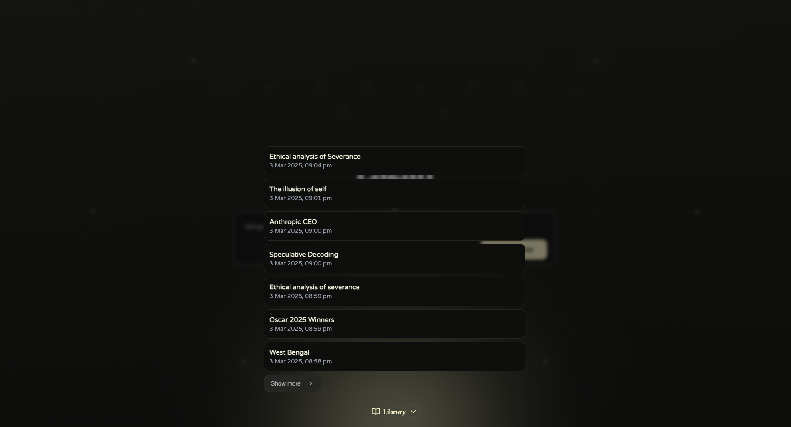

## Eagan
Web search and report generation software. 

A little side project to learn stuff, I intend to make it much much better.

Its still somewhat slow and has (a lot of) bugs, bug I kind of like the search reports it writes now.

This is not for quick searches, but for reading up on a topic on a single page from a detailed overview. It is meant to give you context on a topic.

### Current Features:
- Search and report
- Follow-ups
- Saved chats
- Citations, Markdown formatting etc.

### What I want to add:
- "Blog Mode"
- Image search
- Localized search
- Better search page UI
- Search autocomplete
- *speed*

### What I want to add but will probably not:
- User profiles
- Recommendations

## Screenshots

*Vision, Verve, Wit, Cheer, Humility, Benevolence, Nimbleness, Probity, Wiles*